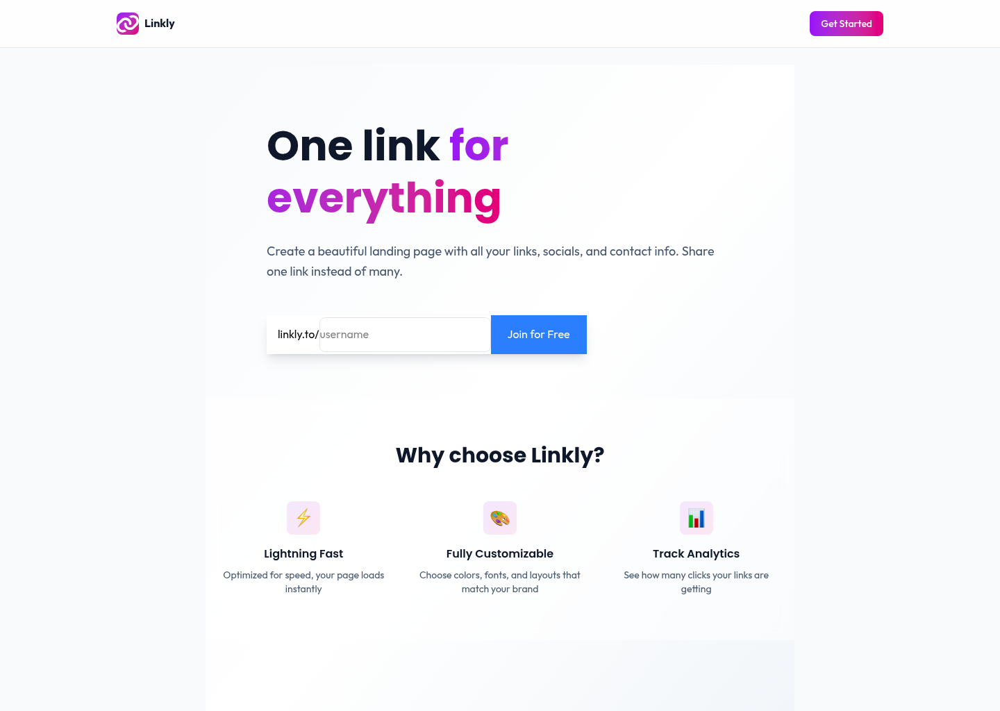

# Linkly

A simple link aggregator that lets you create a beautiful landing page with all your links, socials, and contact info in one place.

Try it live: [linklyyyyy.vercel.app](https://linklyyyyy.vercel.app/)



## Overview

Built with Next.js, React, and MongoDB. Sign up, create your personalized link page with custom branding, organize your links, and track how many people click on them.

## What You Get

- **Sign Up & Login** - Quick authentication with NextAuth.js and Google OAuth
- **Custom Username** - Get your own unique URL path (e.g., linklyyyyy.vercel.app/yourname)
- **Beautiful Landing Page** - Personalize with colors, images, and your bio
- **Organize Links** - Add, edit, and drag-to-reorder your links
- **Track Clicks** - See analytics on how many people visit your links
- **Social Buttons** - Add social media and contact buttons to your page
- **Responsive** - Works perfectly on phone, tablet, and desktop
- **Real-time Updates** - All changes sync instantly to MongoDB

## Tech We Used

**Frontend:**

- Next.js 16.1.6 - Framework
- React 19.2.3 - UI library
- Tailwind CSS 4.2.2 - Styling
- PostCSS 4 - CSS processing
- React Hot Toast 2.6.0 - Notifications
- Recharts 3.8.1 - Analytics charts
- SortableJS 1.15.7 - Drag-and-drop functionality
- FontAwesome Icons - Icon library

**Backend & Database:**

- NextAuth.js 4.24.13 - Authentication
- MongoDB 7.1.1 - Database
- Mongoose 9.3.3 - ODM
- Cloudinary 2.2.0 - Image hosting

## Project Structure

```
linkly/
├── src/
│   ├── app/                      # Next.js app directory
│   │   ├── globals.css           # Global styles
│   │   ├── (website)/            # Public pages
│   │   │   ├── layout.js         # Website layout
│   │   │   ├── page.js           # Landing page
│   │   │   └── login/
│   │   │       └── page.js       # Login page
│   │   ├── (app)/                # Authenticated pages
│   │   │   ├── layout.js         # App layout with sidebar
│   │   │   ├── account/
│   │   │   │   └── page.js       # Account dashboard
│   │   │   └── analytics/
│   │   │       └── page.js       # Analytics page
│   │   ├── (page)/               # Dynamic user pages
│   │   │   └── [uri]/
│   │   │       ├── layout.js     # User page layout
│   │   │       └── page.js       # User's link page
│   │   └── api/                  # API routes
│   │       ├── auth/
│   │       │   └── [...nextauth]/ - Auth endpoints
│   │       ├── click/            # Click tracking
│   │       └── upload/           # Image upload
│   ├── actions/                  # Server actions
│   │   ├── grabUsername.js       # Username availability check
│   │   └── pageActions.js        # Page CRUD operations
│   ├── components/               # Reusable React components
│   │   ├── Chart.js              # Analytics charts
│   │   ├── CopyUrlButton.js      # Copy-to-clipboard button
│   │   ├── Footer.js             # Footer component
│   │   ├── Header.js             # Header navigation
│   │   ├── LinkWithTracking.js   # Link with click tracking
│   │   ├── StatsCard.js          # Stats display card
│   │   ├── buttons/              # Button components
│   │   │   ├── LoginWithGoogle.js
│   │   │   ├── LogoutButton.js
│   │   │   └── SubmitButton.js
│   │   ├── formItems/
│   │   │   └── radioTogglers.js  # Toggle controls
│   │   ├── formResults/
│   │   │   └── UsernameFormResult.js
│   │   ├── forms/                # Form components
│   │   │   ├── HeroForm.js       # Landing page form
│   │   │   ├── PageButtonsForm.js
│   │   │   ├── PageLinksForm.js  # Manage links
│   │   │   ├── PageSettingsForm.js
│   │   │   └── UsernameForm.js
│   │   ├── icons/
│   │   │   └── RightIcon.js
│   │   └── layout/
│   │       ├── AppSidebar.js
│   │       └── SectionBox.js
│   ├── libs/                     # Utility libraries
│   │   ├── mongoClient.js        # MongoDB connection
│   │   └── upload.js             # Cloudinary upload
│   └── models/                   # MongoDB schemas
│       ├── User.js               # User schema
│       ├── Page.js               # User's link page schema
│       └── Event.js              # Click event tracking
├── public/                       # Static assets
├── package.json                  # Dependencies
├── next.config.mjs               # Next.js config
├── tailwind.config.js            # Tailwind CSS config
├── postcss.config.mjs            # PostCSS config
├── eslint.config.mjs             # ESLint config
└── .env                          # Environment variables
```

## Getting Started

### What You Need

- Node.js 18+ (LTS recommended)
- npm or yarn
- MongoDB database (local or cloud like MongoDB Atlas)
- Google OAuth credentials (for login)
- Cloudinary account (for image uploads)

### Installation

**1. Clone the repo**

```bash
git clone https://github.com/thehappyredwolf/linkly.git
cd linkly
```

**2. Install dependencies**

```bash
npm install
```

**3. Set up environment variables**

Create a `.env.local` file in the root directory with your credentials:

```env
# MongoDB
MONGO_URI=your_mongodb_connection_string

# NextAuth.js
NEXTAUTH_SECRET=generate_a_random_secret_key
NEXTAUTH_URL=http://localhost:3000

# Google OAuth
GOOGLE_CLIENT_ID=your_google_client_id
GOOGLE_CLIENT_SECRET=your_google_client_secret

# Cloudinary (for image uploads)
NEXT_PUBLIC_CLOUDINARY_CLOUD_NAME=your_cloudinary_name
CLOUDINARY_API_KEY=your_cloudinary_api_key
CLOUDINARY_API_SECRET=your_cloudinary_api_secret
```

**4. Run the dev server**

```bash
npm run dev
```

Open [http://localhost:3000](http://localhost:3000) in your browser.

## Scripts You Can Run

- `npm run dev` - Start dev server with hot reload
- `npm run build` - Build for production
- `npm start` - Run production build
- `npm run lint` - Check code with ESLint

## How It Actually Works

### The User Journey

1. **Land on homepage** - See what Linkly is and sign up or log in
2. **Sign up with Google** - Quick one-click authentication
3. **Claim your username** - Get your unique URL (e.g., linkly.app/yourname)
4. **Customize your page** - Add bio, profile picture, background color/image
5. **Add your links** - Create links to your website, socials, portfolio, etc.
6. **Add action buttons** - Quick-access buttons for contact or social media
7. **Share your link** - Share your single link across all platforms
8. **Track analytics** - See how many people clicked your links

### Data Structure

Everything is stored in MongoDB with this structure:

**Users** - Store basic user info

```javascript
{
  _id: ObjectId,
  name: "John Doe",
  email: "john@example.com",
  image: "profile_pic_url",
  emailVerified: Date
}
```

**Pages** - User's link landing page

```javascript
{
  _id: ObjectId,
  uri: "yourname",                    // Your unique URL path
  owner: "john@example.com",          // User email
  displayName: "John Doe",            // Display name
  location: "New York, NY",           // Location
  bio: "Designer & Developer",        // Bio
  bgType: "color",                    // "color" or "image"
  bgColor: "#000",                    // Background color
  bgImage: "image_url",               // Background image URL
  buttons: {
    twitter: "https://twitter.com/...",
    github: "https://github.com/...",
    ...
  },
  links: [
    {
      id: "link1",
      title: "My Portfolio",
      url: "https://portfolio.com",
      ...
    },
    ...
  ],
  createdAt: Date,
  updatedAt: Date
}
```

**Events** - Click tracking

```javascript
{
  _id: ObjectId,
  type: "link_click",                 // Event type
  page: "yourname",                   // Which page
  uri: "link1",                       // Which link
  createdAt: Date
}
```

### Key Features Explained

**Username Uniqueness** - Each user gets a unique URL slug. The `grabUsername` action checks availability before creation.

**Link Ordering** - Links are stored in an array and can be reordered with drag-and-drop (SortableJS).

**Click Analytics** - Every time someone visits your page and clicks a link, an Event is recorded in MongoDB for analytics.

**Image Upload** - User profile pictures and backgrounds are uploaded to Cloudinary and stored as URLs.

**Real-time Updates** - Server actions handle form submissions and instantly update MongoDB.

## Design

Built with Tailwind CSS featuring:

- Modern gradient designs
- Mobile-first responsive layout
- Smooth animations and transitions
- Clean, minimal interface
- Dark and light mode support
- Accessible color contrasts

## Environment Variables Reference

| Variable                            | Description                                                          |
| ----------------------------------- | -------------------------------------------------------------------- |
| `MONGO_URI`                         | MongoDB connection string (Atlas or local)                           |
| `NEXTAUTH_SECRET`                   | Secret key for NextAuth.js (generate with `openssl rand -base64 32`) |
| `NEXTAUTH_URL`                      | Your app URL (http://localhost:3000 for dev)                         |
| `GOOGLE_CLIENT_ID`                  | Google OAuth client ID                                               |
| `GOOGLE_CLIENT_SECRET`              | Google OAuth client secret                                           |
| `NEXT_PUBLIC_CLOUDINARY_CLOUD_NAME` | Cloudinary cloud name                                                |
| `CLOUDINARY_API_KEY`                | Cloudinary API key                                                   |
| `CLOUDINARY_API_SECRET`             | Cloudinary API secret                                                |

## Future Ideas

- [ ] Advanced analytics (traffic over time, geographic data)
- [ ] More customization options (fonts, animations)
- [ ] QR code for easy sharing
- [ ] Mobile app version
- [ ] Link expiration/scheduling
- [ ] Team collaboration
- [ ] Dark mode toggle
- [ ] Email notifications
- [ ] Link preview cards
- [ ] Templates and themes

## Performance

- Server-side rendering for fast initial loads
- Image optimization with Cloudinary
- MongoDB indexing for quick queries
- Optimized Tailwind CSS bundle
- Drag-and-drop without page refresh

## License

MIT - Use it however you want. See [LICENSE](LICENSE) for details.
